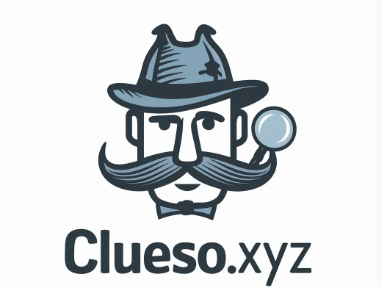
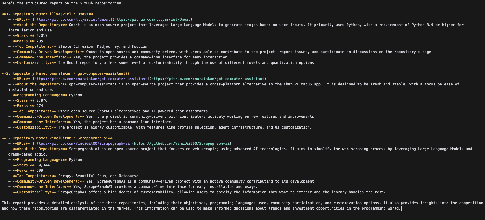

# clueso.xyz



### Overview
The agent system in this project is designed to automate and enhance the process of doing research on cool github projects and set up outreach. Each agent has a specific role that contributes to identifying and engaging with promising GitHub repositories and their contributors.

### Agent Roles and Configurations
- **Venture Analyst**: Initiates personalized outreach based on the researcher's findings.
- **Researcher**: Identifies and summarizes trending GitHub repositories.
- **Partner**: Conducts high-level, personalized communications with potential investees.

### Key Features
- **Configurable Roles**: Each agent's role and behavior can be customized in the `config/agents.yaml`.
- **Inter-Agent Communication**: Agents can pass information and tasks between each other to streamline the venture capital process.
- **Advanced Technologies**: Utilizes AI and NLP for data analysis and personalized communication.

### Setting Up the Tasks
1. **Configure Agent Roles**: Define the tasks and expected outcomes in `config/tasks.yaml`.

```python
@task
def research_task(self) -> Task:
return Task(
config=self.tasks_config['research_task'],
agent=self.researcher(),
output_file='research_output.md'
)
```

### Install and Run

We use python and poetry for this project

`poetry install`

`poetry run python src/main.py`




### Important Repositories

This project utilizes several key technologies and libraries. Below are the repositories for these dependencies:

- **crewAI**: [crewAI Repository](https://github.com/crewAI/crewAI)
  - A library focused on collaborative AI research and development.

- **langchain**: [langchain Repository](https://github.com/langchain/langchain)
  - Langchain facilitates the integration of language models into applications, enhancing natural language processing capabilities.

- **Playwright**: [Playwright Repository](https://github.com/microsoft/playwright)
  - Playwright is a framework for reliable end-to-end testing for modern web apps.

- **Perplexity**: [Perplexity Repository](https://github.com/perplexity/perplexity)
  - Perplexity provides tools for deep analysis and understanding of text data.

Please refer to each repository for more detailed information on their usage and integration into our project.